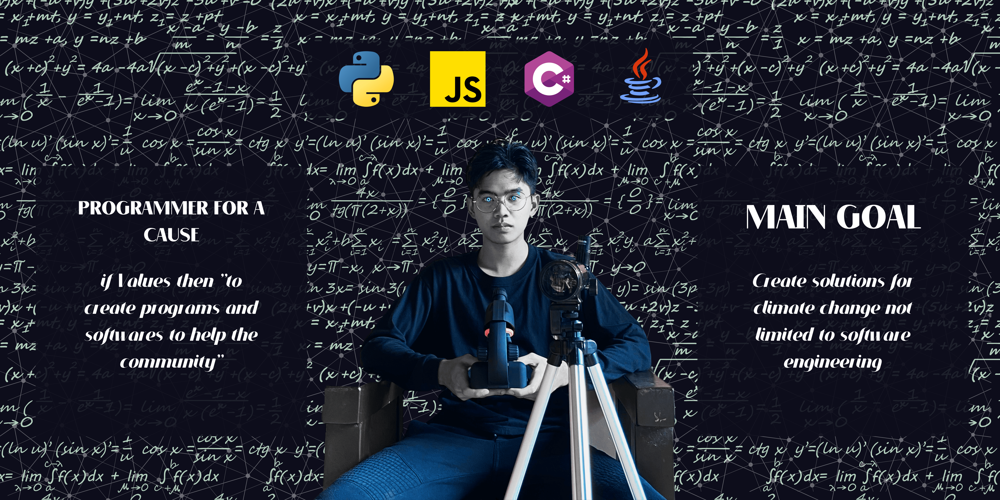

<h1 align="center">Hi 👋, I'm Adrian Gallano</h1>
<h3 align="center">Stoic at day | Programmer at night ( I build software related to climate change and more )</h3>

  

- 🔭 I’m currently working on **Everything :)**

- 🌱 I’m currently learning **Javascript, python, and java**

- 📫 How to reach me **https://www.linkedin.com/in/aidgallano/**

<h3 align="left">Connect with me:</h3>

<h3 align="left">Languages and Tools:</h3>

              

&nbsp;

