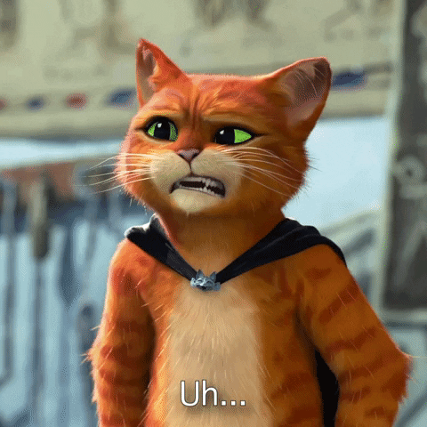

### <h1 style="color:#FFED00">Hello everyone, I am Adrian! 👋</h1>

 
  A 
 Computer Science Student , a 
 Self Proclaimed Comedian, and a 
 <strong style="color:#FFED00"> Life Long Learner </strong>.

I present to you my most used "Ooga Booga Languages"

 hmmm... tbh idk what to write about lol 

### 
 HAHA! Template 

- 🔭 I’m currently working on Frontend development!
- 🌱 I’m currently learning Javascript!
- ⚡ Fun fact: I don't know anything!

